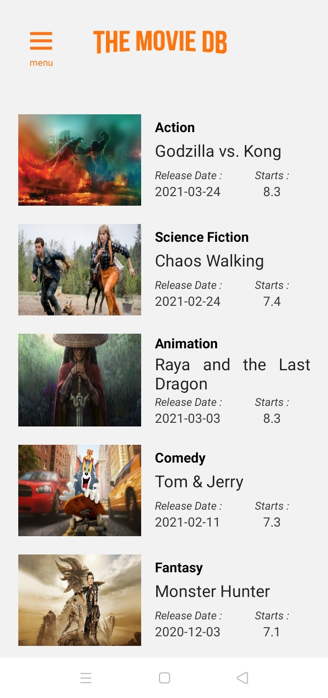

<h1 align="center">TaniBox</h1>

  
  

  Built with React Native.

## Table of Contents

- [Introduction](#introduction)
- [Requirements](#requirements)
- [Usage](#usage-for-development)
- [Create Environment Variable](#create-environment-variable)
- [Screenshots](#screenshots)
- [Release APK](#release-apk)
- [Related Project](#related-project-backend)
- [Contributors](#contributors)

## Introduction

<b>The Movie DB</b>The Movie DB is used to view the top updates from movies and TV series

## Requirements

- [`npm`](https://www.npmjs.com/get-npm)
- [`react-native-cli`](https://facebook.github.io/react-native/docs/getting-started)

## Usage for development

1. Open your terminal or command prompt
2. Type `git clone https://github.com/iipshoifuddin/MovieDBAppTest.git`
3. Open the folder and type `npm install` for install dependencies
6. Type `react-native run-android` for run this app. **_Make sure your device is connected with debugging mode_**.

## Screenshots

    
    
    
    
    
    
    
    

## Release APK

## Related Project (Backend)

- [`Backend TaniBox`](https://github.com/reihnagm/TaniBox-Backend)

## Contributors

<ul>

</ul>
  <table align="center">
    <tr>   
      <td align="center">
        <a href="https://github.com/iipshoifuddin">
           
        </a>
          <b>Iip Shoifuddin</b> 
          (React native)
      </td>
    </tr>
  </table>

